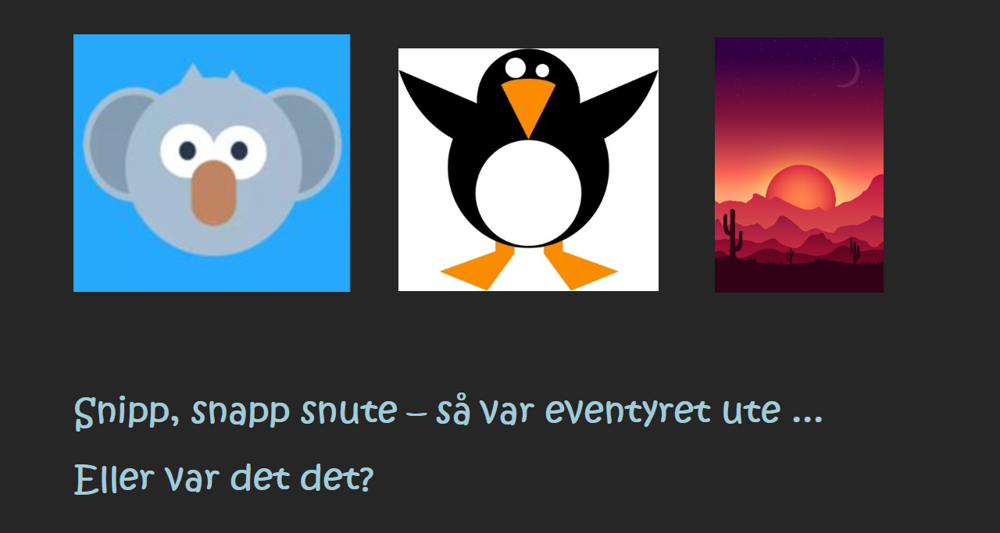

# Barneboka
## Tverrfaglig oppgave i konseptutvikling og programmering og produksjon og historiefortelling 

## Interaktiv barnebok på nett med flere mulige avslutninger 

I denne oppgaven skal dere lage en barnebok som skal utformes som et nettsted. Boka skal fortelle en historie med to eller flere mulige avslutninger. Historien skal fortelles med enkle, vektorbaserte illustrasjoner/animasjoner laget i Illustrator og minst en animasjon laget i Animate eller After Effects.  

 

## Krav til oppgaven: 

- Boka skal ha en forside (index.html) med navn på historien hvor du kan klikke deg videre og sider som forteller historien, bilde for bilde. 

- Boka skal ha minst ett «veiskille» hvor du kan velge to ulike utfall av historien og konsekvensene av dette valget. 

- Det skal være mulig å komme tilbake til startsiden fra alle «sidene» i historien. 

- Boka skal være responsiv slik at den kan leses på nettbrett, pc og smarttelefon. 

- Minst en av sidene skal inneholde en animasjon. 

 [Vurderingskriterier og kompetansemål](kriterierKompmaal.md)
 